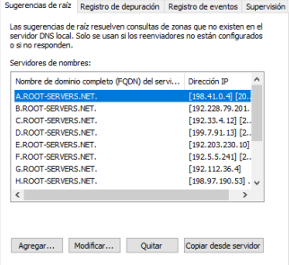

## Tarefa 1.2 - Instalación de zonas mestras primarias en Windows Server

1. Instala o servidor DNS no equipo lukeskywalker. Comproba que xa funciona coma servidor DNS caché pegando no documento de entrega a saída deste comando  nslookup -norecurse www.starwars.com localhost
**SOLUCIÓN:**

- Cambiamos o nombre do equipo:
        
    
    
- Poñemos IP estática:
    
    

- Nas suxerencias de raíz, engadimos en "copiar desde servidor": 8.8.8.8 e 10.0.4.1
    
    

- Comprobación (segue sen funcionar):
    
    

2.Configura o servidor DNS para que empregue como reenviador 8.8.8.8. pegando no documento de entrega a captura de pantalla da configuración do reenviador e a saída deste comando: nslookup -recurse www.starwars.com localhost
**SOLUCIÓN:**
- Engadimos reenviadores de Google:
    
    

- Saída do comando:
    
    

2. Instala unha zona primaria de resolución directa chamada "academia.jedi" e engade os seguintes rexistros de recursos (a maiores dos rexistros NS e SOA imprescindibles):
    - Tipo A: lukeskywalker con IP 192.168.20.101
    - Tipo A: benskywalker con IP 192.168.20.102
    - Tipo A: obiwankenobi con IP 192.168.56.152 e 192.168.56.153
    - Tipo A: hansolo con IP 192.168.56.105
    - Tipo A: leia con IP 192.168.56.106
    - Tipo A: anakinsolo con IP 192.168.56.106
    - Tipo CNAME mestrejedi a obiwankenobi
    - TIPO MX con prioridade 10 sobre o equipo hansolo
    - TIPO TXT "thon" con "un Jedi debe sentir a tensión entre os dous lados da Forza"
    - TIPO NS con benskywalker
Pega no documento de entrega a captura dos rexistros creados

**SOLUCION:**

- Poñemos o servidor DNS como el mesmo:
    
    

- NS para a zona directa e indirecta

    

- SOA da zona directa e da inversa:
    
    

- Rexistro de zona directa:

    

3. Instala unha zona de resolución inversa que teña que ver co enderezo do equipo lukeskywalker, e engade rexistros PTR para os rexistros tipo A do exercicio anterior. Pega no documento de entrega o a captura dos rexistros da zona.

**SOLUCIÓN:**

- Rezistro de zona inversa:

    

4. Comproba que podes resolver os distintos rexistros de recursos. Pega no documento de entrega a saída dos comandos:

**SOLUCIÓN:**

- nslookup lukeskywalker.academia.jedi localhost
        
    

- nslookup hansolo.academia.jedi localhost

    

- nslookup leia.academia.jedi localhost

    

- nslookup anakinsolo.academia.jedi localhost

    

- nslookup academia.jedi localhost

    

- nslookup -q=mx academia.jedi localhost

    

- nslookup -q=ns academia.jedi localhost

    

- nslookup -q=soa academia.jedi localhost

    

- nslookup -q=txt thon.academia.jedi localhost

    

- nslookup 192.168.56.101 localhost

    
